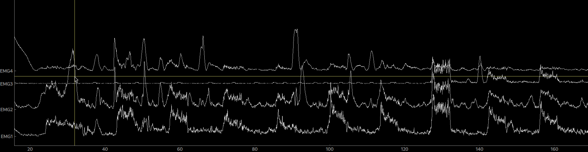
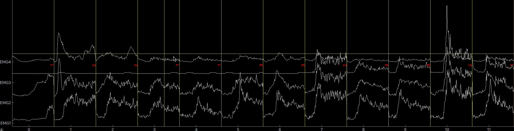

# MyoPy

MyoPy is an open-source Python package for the preprocessing and analysis of electrophysiological muscle signals. In its current state, it only allows for preprocessing raw data into epochs, estimating the EMG onset and extracting features from the EMG data for classification / machine learning.

## Installation

To get the latest version of MyoPy clone the repository

```
https://github.com/k0ssmann/myopy
```

and install it via

```
python setup.py install
```

## Dependencies

- Python>=3.11
- numpy>=1.26
- pandas>=2.2.0
- PyQt5>=5.15
- pyqtgraph>=0.13


## Usage

MyoPy supports in its current state only input from tabular files. To show the basic functionalities of MyoPy, we'll use the example data provided in `datasets'.
Let's start by importing the required modules for reading your EMG data from tabular files

```python
from myopy.info import create_info
from myopy.io.tables import tables
from myopy.epochs import Epochs
from myopy.events import find_events
```

In the next step, we want to create an `Info` object that stores information such as the names of the EMG channels and the sample rate

```python
ch_names = ['EMG1', 'EMG2', 'EMG3', 'EMG4']
sfreq = 20
info = create_info(ch_names, sfreq)
``` 

As most EMG data stored in a tabular format isn't standardized, we have to provide information where in the file, i.e in which columns, our data is and, if available, in which columns our events are encoded (usually in TTL). Then we can create a `Raw` object from our data

For the provided dataset this would look like this

```python
fname = './datasets/01-01.txt'
col_data = [19, 20, 21, 22]
col_events = [23, 24, 25, 26]
raw = tables.read_table(fname=fname, info=info, col_data=[19,20,21,22], col_events=[23,24,25,26], delimiter='\t')
```

By calling `plot(picks=[0,1,2,3])` on the `raw` object we can now plot our data.



To cut our data into segments (epoching) we have to create an `Epoch` object by first finding event onsets and specifying which events we want to see. In the example dataset the event IDs range from 0 - 7, however, only 1 - 6 contain event-correlated muscle signals.

```python
event_ids = [1, 2, 3, 4, 5, 6]
events = find_events(raw)
epo = Epochs(raw, events=events, event_id=event_ids, picks=[0,1,2,3], tmin=0, tmax=5.0)
```

Again, the epoched data can be plotted by calling `plot()` on the `Epoch` object. By clicking on an epoch you can mark it as bad and by calling `drop_bads()` you can remove them.



## License

MyoPy is licensed under the MIT license.
